# javascript 

## 代码

https://thimble.mozilla.org/en-US/user/idiottiger/2409186

## 基础

null & undefined：转换成数值时，null 为0，undefined 为 NaN

false：undefined null false 0 NaN "" ''，所有数字是以**64位浮点数**形式存储，浮点数的 === 比较为 false

数值相关操作：

```javascript
parseInt(...)
parseFloat(...)
```

对象：

javascript 不是一门真正意义上的面对对象语言

```javascript
var obj = {
  //field 
  k: 'id',
  //function  
  p: function (x) {
    return 2 * x;
  }
};

//ref
obj.k
obj['k']

//允许属性后绑定
obj.v = ...

//查看所有属性，返回属性数组
Object.keys(obj); 

//删除一个属性
delete obj.k

//
for...in
    
//对象
function Obj_name(obj_args...){
    ...
}
```

函数：

```javascript
function func(s){
    
}

//匿名函数
var func = function(s){
    
};
```

Error：

```javascript
try{
   throw new Error('');
}
catch(e){
    
}finally{
    
}
```

Let vs var：`let` 声明的变量只在它所在的代码块有效，比如 `for` 循环

严格模式：

```javascript
"use strict"
//严格模式：
//1.更安全
//2.编译器可以找到潜在的问题点
```


## 高级

### 1. Promise

#### 基础用法

```javascript
new Promise( function(resolve, reject) {...} /* executor */  );

var promise = new Promise(function(resolve, reject){
   //do something
   //if ok
   resolve
   //if error
   reject
});

promise.then(f1(), f2()).catch(f2())

//f1 = resolve method
//f2 = reject method
```




#### 链式调用：

```javascript
job1.then(job2).then(job3).catch(handleError)

Promise.all[job1,job2].then(...)
Promise.race[job1,job2].then(...)
```


Api 定义：[https://developer.mozilla.org/zh-CN/docs/Web/JavaScript/Reference/Global_Objects/Promise](https://developer.mozilla.org/zh-CN/docs/Web/JavaScript/Reference/Global_Objects/Promise)


```javascript
// 写法一
f1().then(function () {
  return f2();
}).then(f3);

// 写法二
f1().then(function () {
  f2();
  return;
}).then(f3);

// 写法三
f1().then(f2())
  .then(f3);

// 写法四
f1().then(f2)
  .then(f3);
```


### 2. async/await

```javascript
async function f() {

  let promise = new Promise((resolve, reject) => {
    setTimeout(() => resolve("done!"), 1000)
  });

  let result = await promise; // wait till the promise resolves (*)

  alert(result); // "done!"
}

f();
```

`await` literally makes JavaScript wait until the promise settles, and then go on with the result. That doesn’t cost any CPU resources, because the engine **can do other jobs meanwhile: execute other scripts, handle events** etc.

When we use `async/await`, we rarely need `.then`, because `await` handles the waiting for us. And we can use a regular `try..catch` instead of `.catch`. That’s usually (not always) more convenient.

The `async` keyword before a function has two effects:

1. Makes it always return a promise.
2. Allows to use `await` in it.

The `await` keyword before a promise makes **JavaScript wait until that promise settles**, and then:

1. If it’s an error, the exception is generated, same as if `throw error` were called at that very place.
2. Otherwise, it returns the result, so we can assign it to a value.

Together they provide a great framework to write asynchronous code that is easy both to read and write.

With `async/await` we rarely need to write `promise.then/catch`, but we still shouldn’t forget that they are based on promises, because sometimes (e.g. in the outermost scope) we have to use these methods. Also `Promise.all` is a nice thing to wait for many tasks simultaneously. 


### 3. module

>http://imweb.io/topic/582293894067ce9726778be9

export & import

```javascript
//module js 文件声明导出方法

funtion func(){
    
}

//node
module.exports = {
    ...
    ...
}
    
//es 6
export={
    
}

//import 编译时加载
import * as xxx from ...
import {xxx, xxx, xxx} from ...

//require 运行时加载

```


